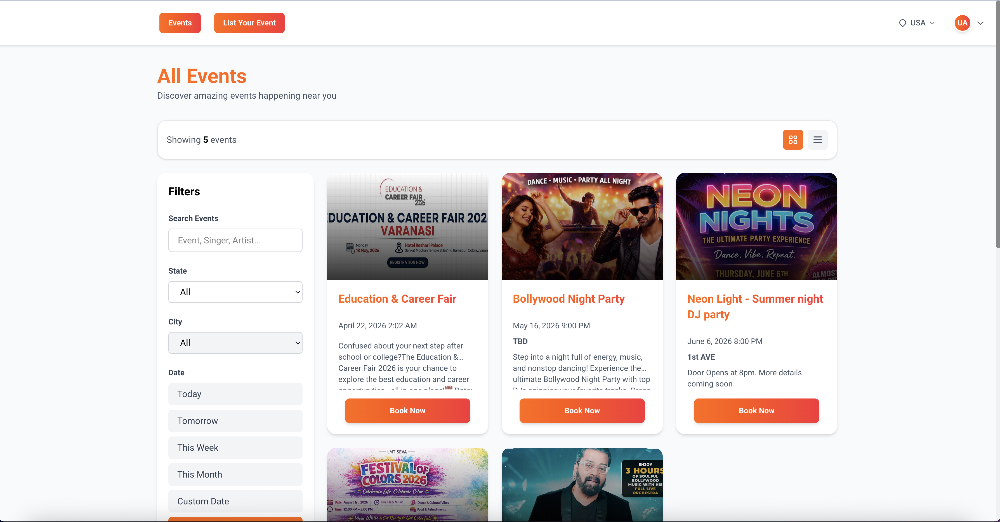
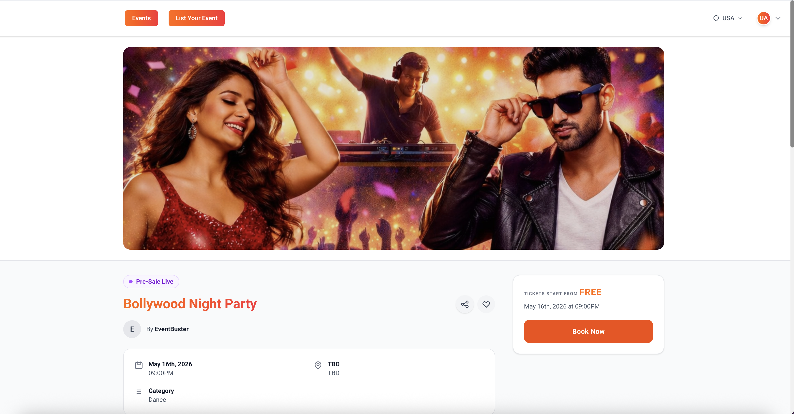
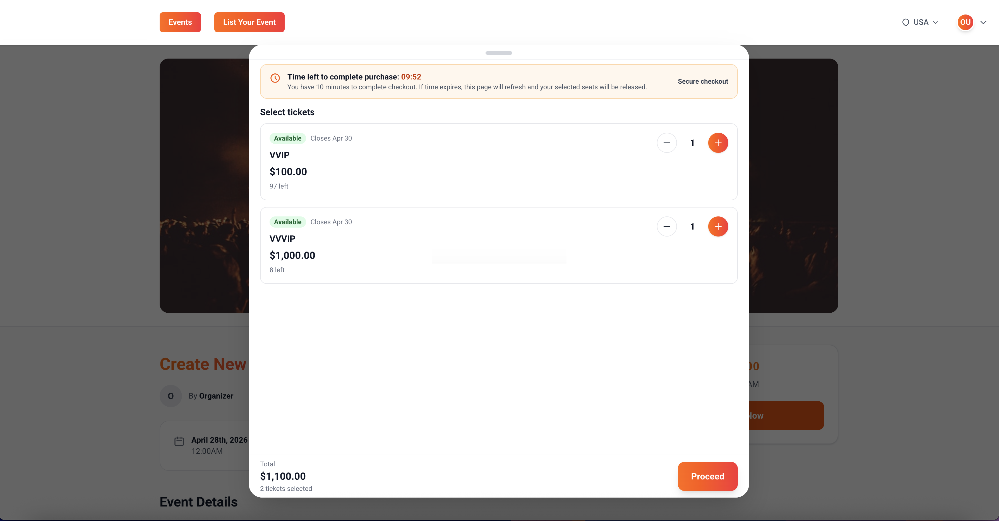
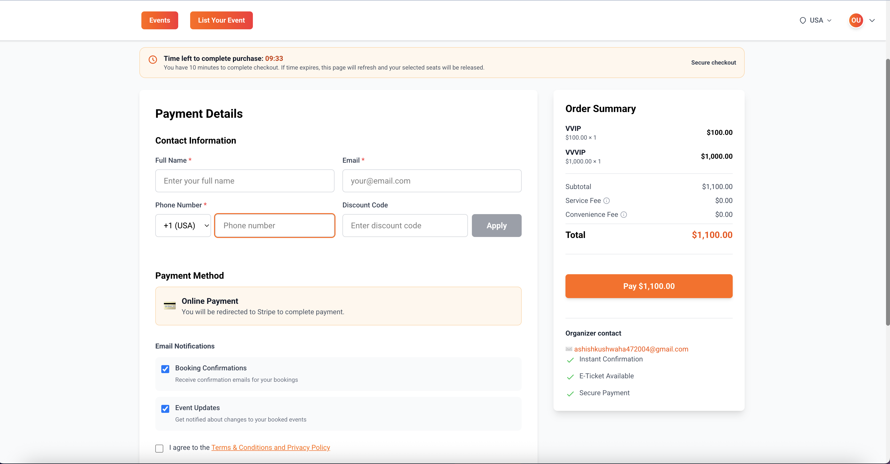
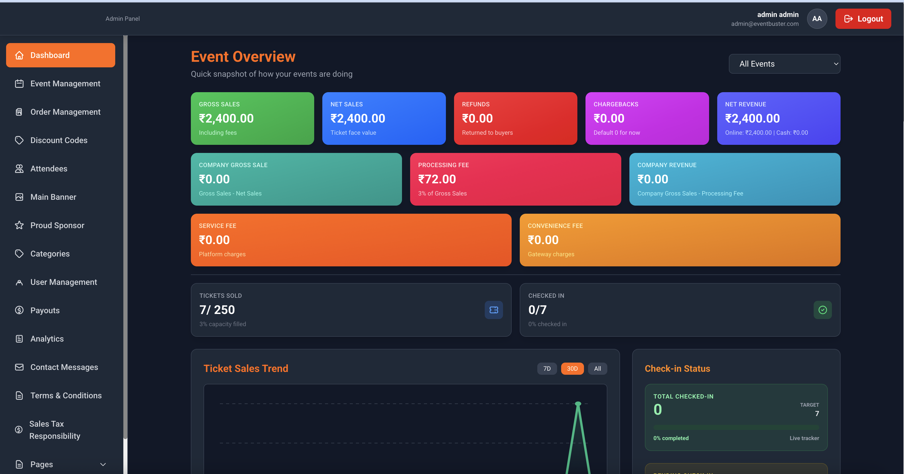
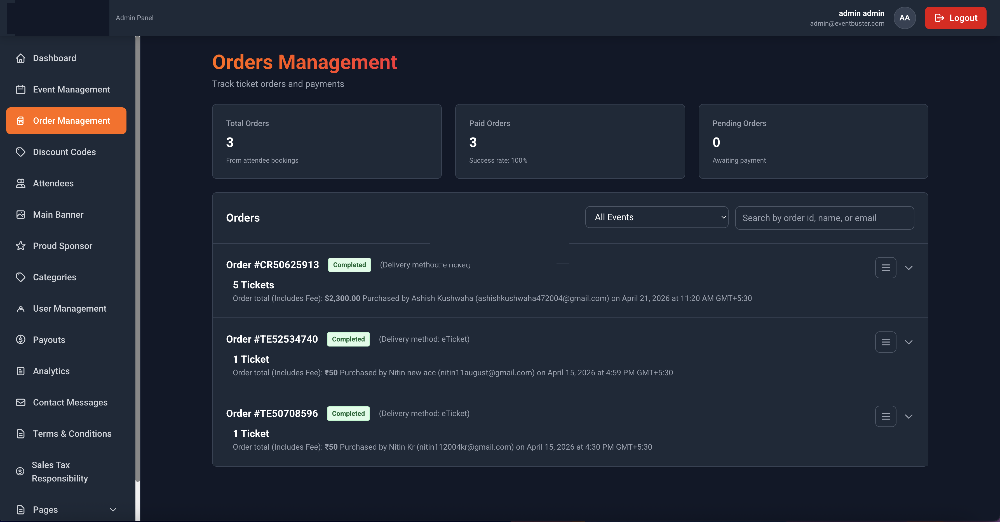
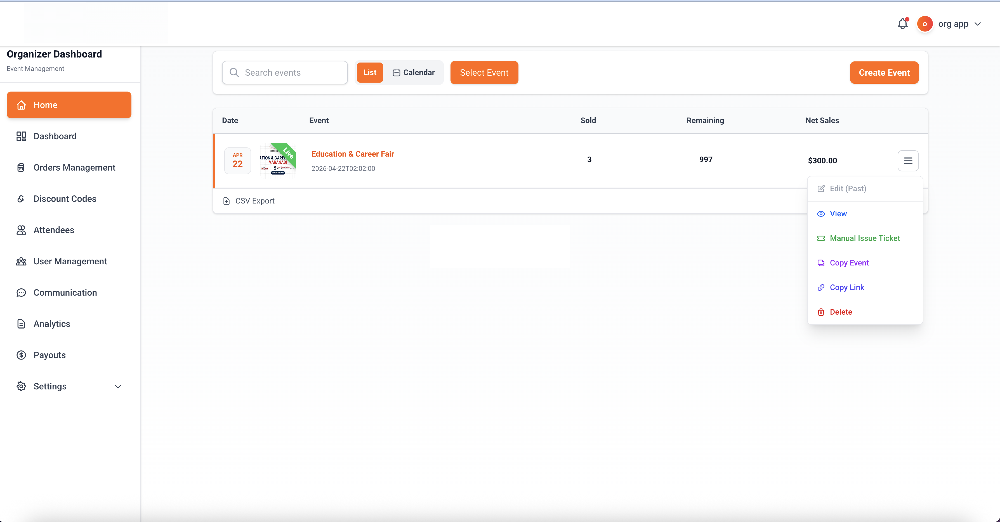
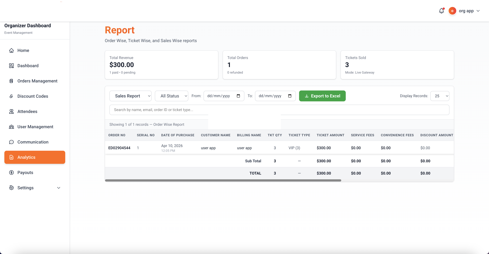
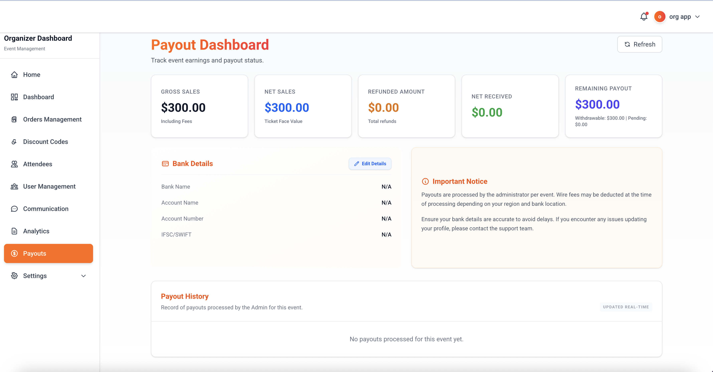

# 🎟️ Event Booking System with Seating (Multi-Vendor)

A modern **event booking platform with seating management** built for event organizers, venues, and ticketing businesses.

Supports **real-time seat selection, booking management, payouts, and analytics**.

---

## 🚀 Key Features

* 🎟️ Event Booking with Seat Selection
* 🪑 Real-Time Seating Inventory
* 👥 Multi-Organizer Support
* 💳 Secure Checkout System
* 🎯 Discount Codes & Offers
* 📊 Advanced Analytics & Reports
* 💰 Organizer Payout System
* 📱 Flutter Mobile Apps (User + Organizer)
* 🌐 Web Platform (Next.js + MongoDB)
* ➕ And Many More...

---

# 📸 Screenshots

## 🏠 Home

## 🎫 Events Listing

## 📄 Event Details

## 🪑 Seating / Inventory

## 💳 Checkout

---

## 🧑‍💼 Admin Panel

## 📦 Order Management

---

## 🎤 Organizer Dashboard

## 📊 Reports

## 💰 Payouts

---

# 🧑‍💼 Admin Panel Features

## 📊 Dashboard

* System Overview & Analytics

---

## 🎟️ Event Management

* Create & Manage Events
* Event Categories
* Event Listings Control

---

## 📦 Order Management

* Booking Orders
* Payment Tracking
* Order Status Control

---

## 🎯 Marketing & Promotions

* Discount Codes
* Main Banner Management
* Sponsors Management

---

## 👥 User Management

* Platform Users
* Attendees Management

---

## 💰 Financial

* Organizer Payout Management
* Sales Tax Configuration

---

## 📊 Reports & Analytics

* Platform Analytics
* Sales Reports

---

## 📩 Communication

* Contact Messages
* Terms & Pages Management

---

# 🎤 Organizer Panel Features

## 🏠 Dashboard

* Organizer Home & Insights
* Revenue Overview

---

## 📦 Orders Management

* View All Bookings
* Order Tracking

---

## 🎟️ Event Operations

* Attendees Management
* Ticket Handling

---

## 🎯 Marketing Tools

* Discount Codes

---

## 👥 Team Management

* User / Staff Management

---

## 💬 Communication

* Customer Messaging

---

## 📊 Analytics

* Event Performance
* Sales Reports

---

## 💰 Payout System

* Earnings Tracking
* Withdraw / Payout Management

---

## ⚙️ Settings

* Organizer Preferences

---

# 👤 User Features

## 🎟️ Event Experience

* Browse Events
* View Event Details

---

## ❤️ Wishlist

* Save Favorite Events

---

## 📦 Booking System

* Book Tickets with Seating
* Real-Time Seat Selection

---

## 📄 Ticket Access

* Download Ticket PDF
* View Ticket
* QR Code for Entry

---

## 💳 Payments

* Secure Checkout

---

## 📊 History

* Booking History
* Orders Tracking

---

# 📱 Mobile Applications

* 📱 Flutter App for Users
* 📱 Flutter App for Organizers

---

# ⚙️ Tech Stack

* 🌐 Frontend: Next.js
* 🧠 Backend: Node.js
* 🗄️ Database: MongoDB
* 📱 Mobile: Flutter

---

# 💼 Pricing

* 💰 One-Time License: ₹20,000+
* 🔁 SaaS Model Available

(Custom pricing for large-scale platforms)

---

# 📞 Contact & Support

📧 Email: [mksingh.singh888@gmail.com](mailto:mksingh.singh888@gmail.com)
📱 WhatsApp: +91-9650816169

* Free support: 7 days
* Paid customization available

---

# 🔒 Note

This repository is for **showcase purposes only**.
Source code access is **restricted / private**.

---

⭐ Interested? Contact now for demo & business setup!
